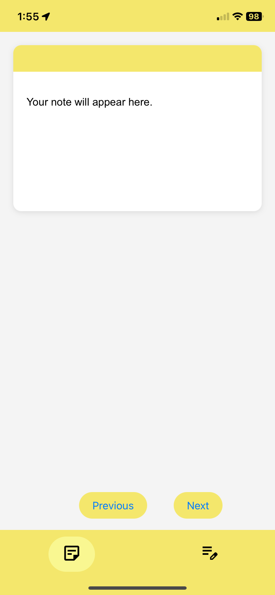
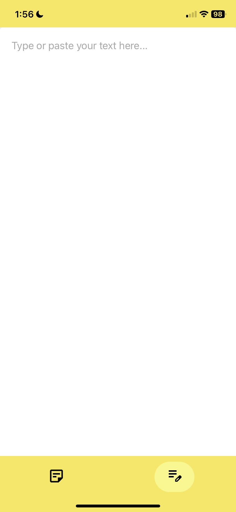

# Notes-Web-App

A simple and sleek notes app to help you study effectively.

  
  

## Features

- **Sticky Note Summaries:** Notes are summarized in small sticky note sections for easy review.
- **Local Storage:** Notes are saved locally, so they remain even if the app is closed.
- **Minimal Design:** A clean interface to keep you focused.

## How to Use

1. **Create a Note:** Start typing in the input section.
2. **View Summary:** Your note will display as a sticky note.
3. **Persistent Storage:** Notes are saved locally for future access.

## Navbar

- **Left Button:** View your note summaries.
- **Right Button:** Continue typing your notes.
